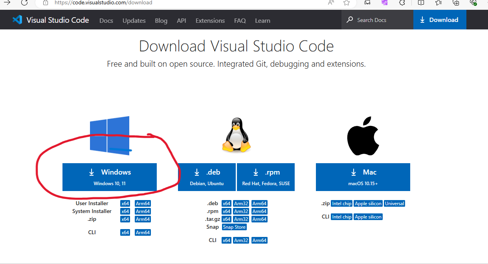
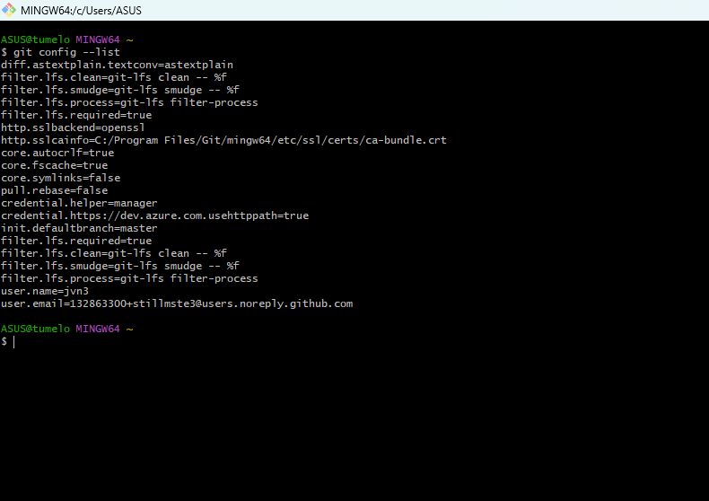
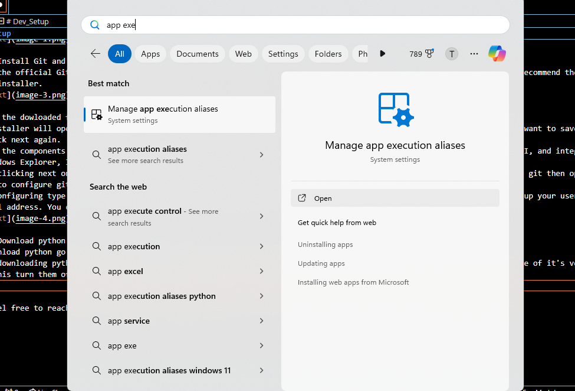
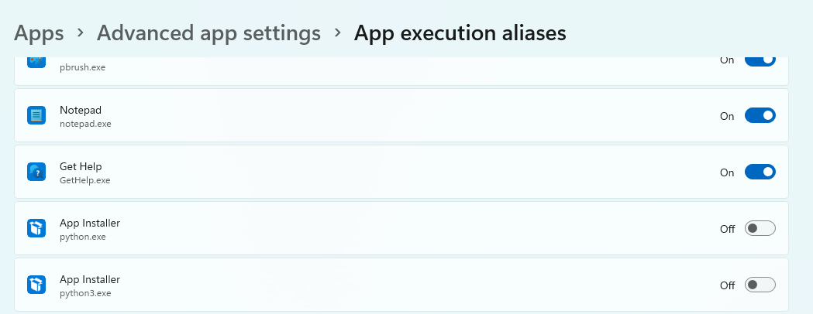

# Dev_Setup
Setup Development Environment

#Assignment: Setting Up Your Developer Environment

#Objective:
This assignment aims to familiarize you with the tools and configurations necessary to set up an efficient developer environment for software engineering projects. Completing this assignment will give you the skills required to set up a robust and productive workspace conducive to coding, debugging, version control, and collaboration.

#Tasks:

1. Select Your Operating System (OS):
   Choose an operating system that best suits your preferences and project requirements. Download and Install Windows 11. https://www.microsoft.com/software-download/windows11

2. Install a Text Editor or Integrated Development Environment (IDE):
   Select and install a text editor or IDE suitable for your programming languages and workflow. Download and Install Visual Studio Code. https://code.visualstudio.com/Download
3. Set Up Version Control System:
   Install Git and configure it on your local machine. Create a GitHub account for hosting your repositories. Initialize a Git repository for your project and make your first commit. https://github.com

4. Install Necessary Programming Languages and Runtimes:
  Instal Python from http://wwww.python.org programming language required for your project and install their respective compilers, interpreters, or runtimes. Ensure you have the necessary tools to build and execute your code.

5. Install Package Managers:
   If applicable, install package managers like pip (Python).

6. Configure a Database (MySQL):
   Download and install MySQL database. https://dev.mysql.com/downloads/windows/installer/5.7.html

7. Set Up Development Environments and Virtualization (Optional):
   Consider using virtualization tools like Docker or virtual machines to isolate project dependencies and ensure consistent environments across different machines.

8. Explore Extensions and Plugins:
   Explore available extensions, plugins, and add-ons for your chosen text editor or IDE to enhance functionality, such as syntax highlighting, linting, code formatting, and version control integration.

9. Document Your Setup:
    Create a comprehensive document outlining the steps you've taken to set up your developer environment. Include any configurations, customizations, or troubleshooting steps encountered during the process. 

#Deliverables:
- Document detailing the setup process with step-by-step instructions and screenshots where necessary.
- A GitHub repository containing a sample project initialized with Git and any necessary configuration files (e.g., .gitignore).
- A reflection on the challenges faced during setup and strategies employed to overcome them.

#Submission:
Submit your document and GitHub repository link through the designated platform or email to the instructor by the specified deadline.

#Evaluation Criteria:**
- Completeness and accuracy of setup documentation.
- Effectiveness of version control implementation.
- Appropriateness of tools selected for the project requirements.
- Clarity of reflection on challenges and solutions encountered.
- Adherence to submission guidelines and deadlines.

ANSWERS:

Step 1: dowmload an operating system. I used the one that came with my pc which is Windows 11. But if you wish to use a different OS you could just download the one you desire by simply searching for it then download it.

Step 2: Install an IDE.
- To install vs code on windows, search for vs code on the web then click the download button

- After clicking the download link you'll be directed inside the vscode website where you'll click the download button for windows and vscode will start to download.

Step 3: Install Git and github.
- Go to the official Git website and select the Windows version. The website will automatically detect your OS version and recommend the correct installer.

- Locate the dowloaded file on your downloads and click it to run the git setup.
- The installer will open with a license agreement, read through it then click next to proceed. Choose the folder where you want to save git then click next again.
- Choose the components you want to install, then click next. The installer offers several options like a Git Bash, a Git GUI, and integration with Windows Explorer, I left them at their default settings the clicked next.
- After clicking next on every step after leaving everything on it's default settings, I clicked finish to finish setting up git then opened gitbash to configure git.
- When configuring type git config --global user.name "user name" then git config –global user.email "email address" to set up your username and email address. You can see your git configure list by typing git config --list when you want to see your settings.

Step 4: Download python
- To download python go to python.org and download the latest version for Windows.
- After downloading python, go to App execution aliases because they will interfere with python and not allow you to use some of it's versions. To fix this turn them off by first searching for the app execution alias control panel from the Start menu
 

- After turning them off you can check pip version by typing pip --version or pip -v in the terminal. If it says module does not exist then you have to download pip. I downloaded pip with the help of AI by following it's precise instructions. Then I had pip. You can also use stackoverflow when you are stuck with somwthing.

- To create a virtual environment you simply just type python3 -m venv env or python3 -m virtualenv env in the directory you want to create the virtual environment. But first you will have to install virtual environment by typing pip install virtualenv

Note: Feel free to reach out for clarification or assistance with any aspect of the assignment.
